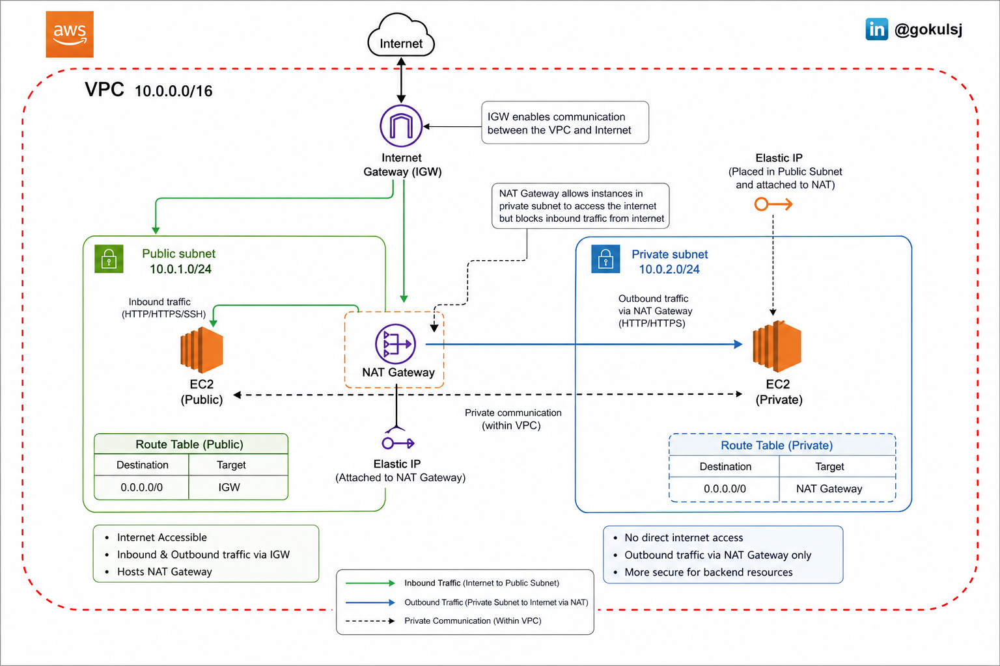
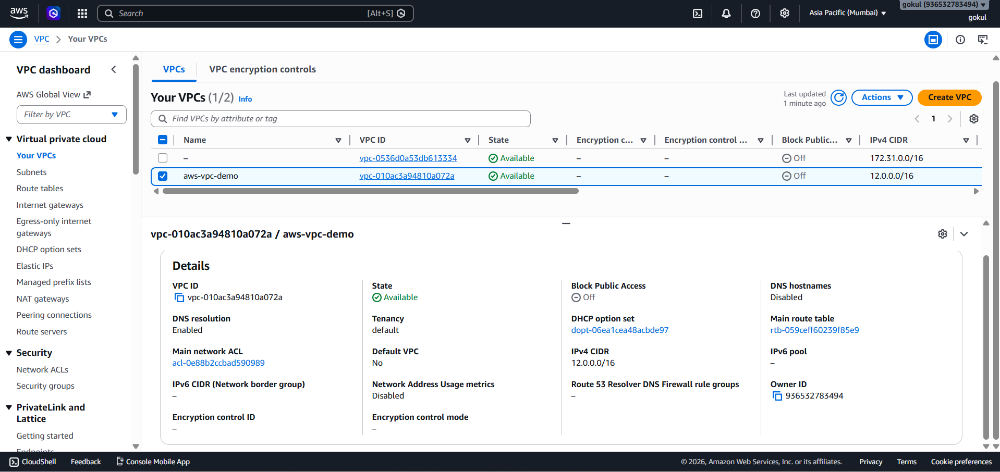
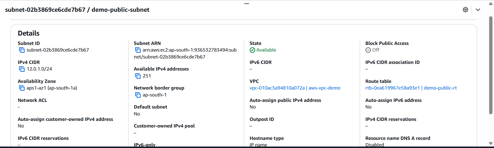
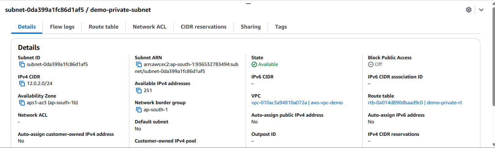
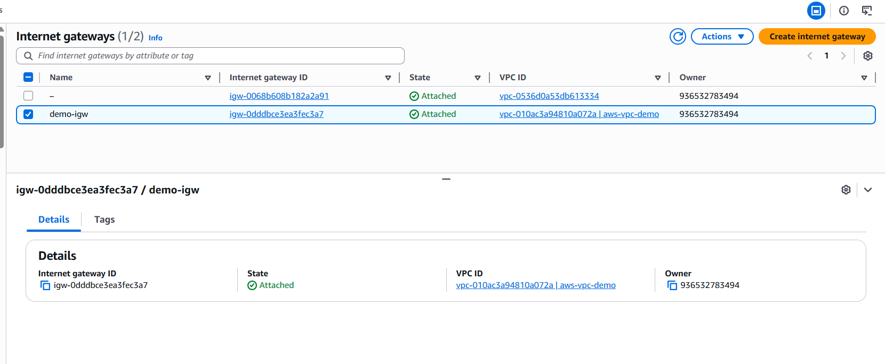
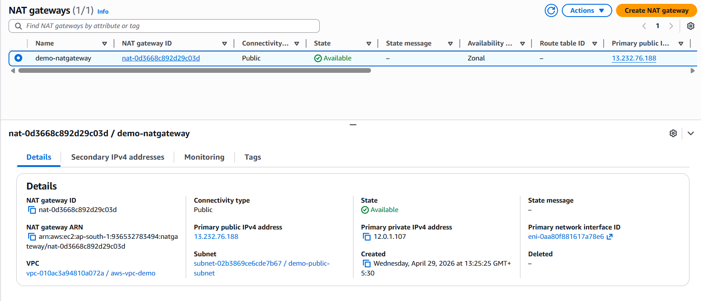
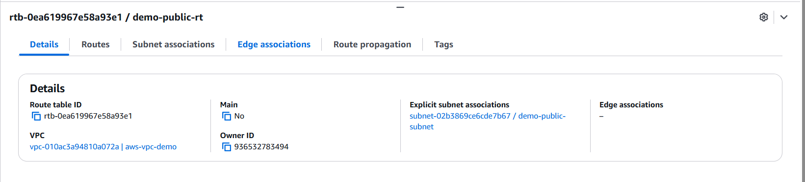
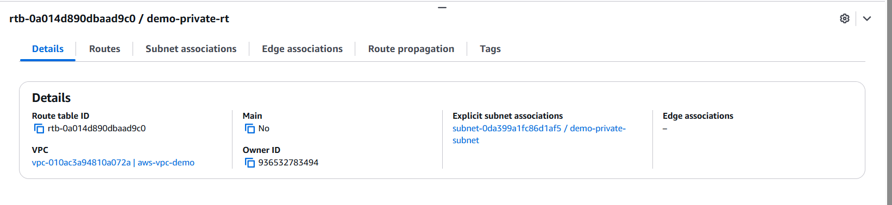
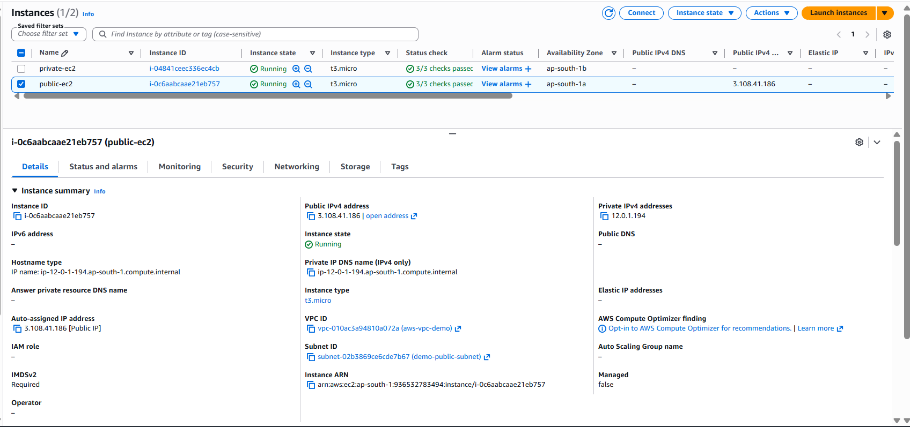
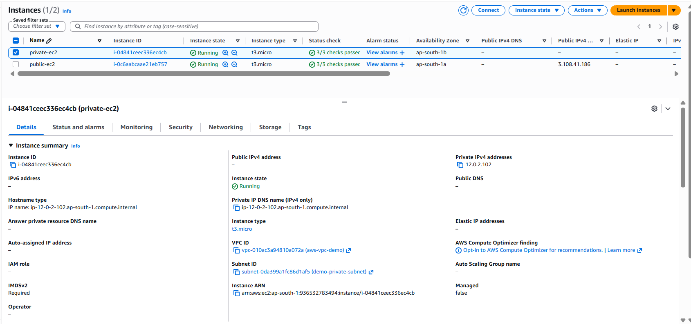

# 🚀 AWS VPC Architecture Lab

## 📌 Overview

This project demonstrates a secure AWS VPC setup with **public and private subnets**, using an **Internet Gateway (IGW)** and **NAT Gateway** for controlled internet access.

---

## 🧱 Architecture

* VPC: 10.0.0.0/16
* Public Subnet: 10.0.1.0/24
* Private Subnet: 10.0.2.0/24
* IGW + NAT Gateway
* Route Tables controlling traffic
* EC2 instances in both subnets

---

## 📊 Architecture Diagram

---

## 🔄 Traffic Flow

* Public: Internet → IGW → EC2
* Private: EC2 → NAT → IGW → Internet

---

## 📸 Screenshots

### 🏗️ VPC

---

### 🌐 Subnets

**Public Subnet**

**Private Subnet**

---

### 🚪 Internet Gateway

---

### 🔁 NAT Gateway

---

### 🧭 Route Tables

**Public Route Table**

**Private Route Table**

---

### 🖥️ EC2 Instances

**Public EC2**

**Private EC2**

---

## 🧠 Key Learnings

* Public vs Private subnet behavior
* IGW vs NAT Gateway usage
* Route table importance
* Secure AWS architecture basics

---

## 🧹 Cleanup

All resources deleted after testing to avoid cost.

---
